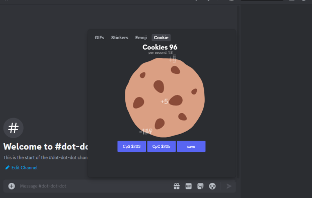

cookieClicker uses a custom api to add itself to the emoji panel as the image below shows


# How to install CookieClicker and the api

this [commit](https://github.com/Vendicated/Vencord/commit/603467b5c2eb155e49861544a700dedbb91109fb) tells you the changes made to add this plugin. 

if you can't figure it out with the commit. 
### follow this method

I made a python script to automatically download the commit. make sure to have python installed and requests with `python -m pip install requests`


even who doesn't have knowledge in programming should be able to read this
```py
import requests
from pathlib import Path

base_url = "https://raw.githubusercontent.com/programminglaboratorys/Vencord/603467b5c2eb155e49861544a700dedbb91109fb/"

urls = [
    "src/api/index.ts",
    "src/api/Tablists.tsx",
    "src/plugins/_api/tablists.tsx",
    "src/plugins/cookieClicker/index.tsx",
    "src/plugins/cookieClicker/style.css"
]

for url_path in urls:
    full_url = base_url + url_path
    
    response = requests.get(full_url)
    
    if response.status_code == 200:
        Path(url_path).parent.mkdir(parents=True, exist_ok=True) # mkdir stand for make dir duh
        with open(url_path, 'wb') as file:
            file.write(response.content)
        print(f"Downloaded {url_path}")
    else:
        print(f"Failed to download {url_path}, try again to avoid problems")
input("enter to exit:")
```
where you need to run this file? in the root folder of Vencord folder beside the src file. the folder tree should looks like this
```py
Vencord
├── CODE_OF_CONDUCT.md
├── CONTRIBUTING.md
├── LICENSE
├── README.md
├── browser
├── dist
├── docs
├── downloader.py # our python code
├── node_modules
├── package.json
├── patches
├── pnpm-lock.yaml
├── scripts
├── src
└── tsconfig.json
```

than run the python file, click it twice or run it in terminal
```py
C:/Users/Cookie/desktop/Vencord>python downloader.py
```


than follow the [Vencord installation guide](https://github.com/programminglaboratorys/Vencord/blob/main/docs/1_INSTALLING.md)
